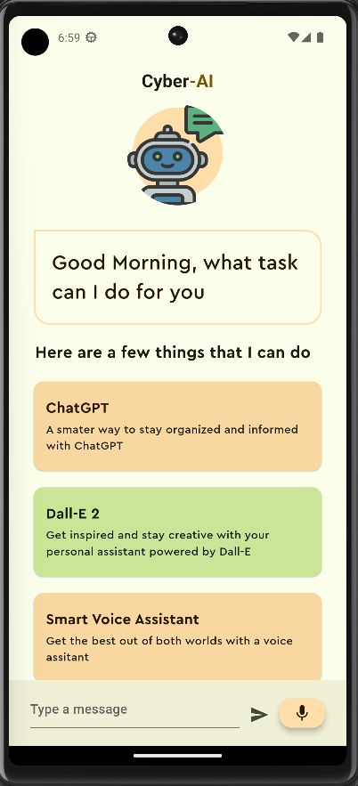
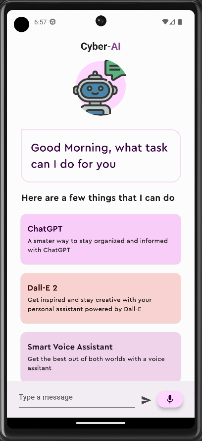
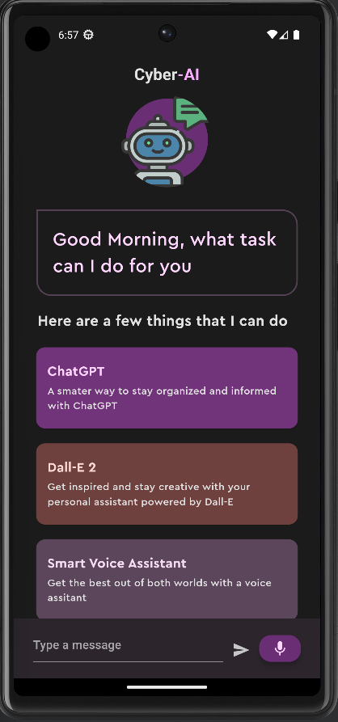
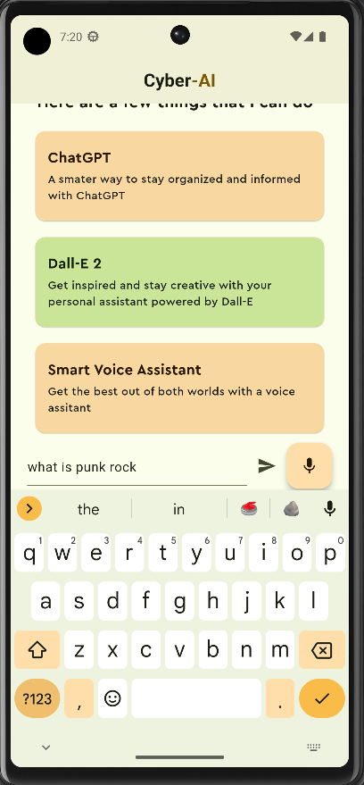
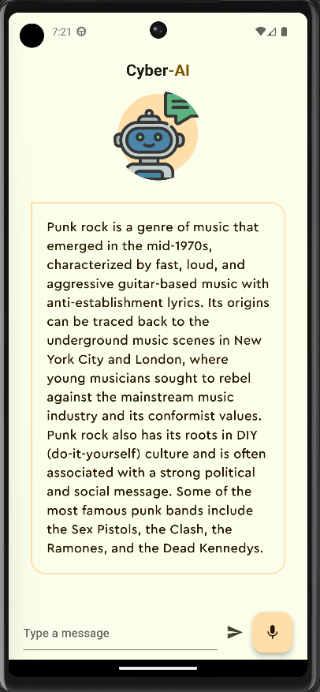
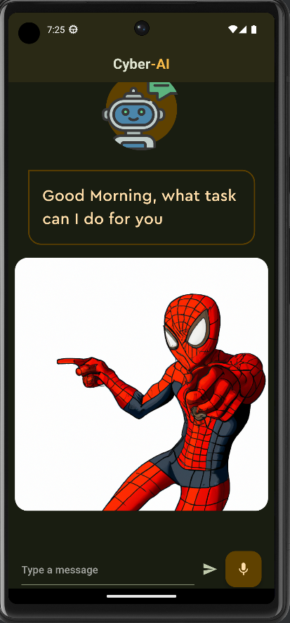

# Cypher-AI - A ChatGPT based chat bot

Cypher-AI is an advanced chat bot powered by state-of-the-art AI technologies. It leverages the power of [GPT 3.5](https://openai.com/) for natural language processing and conversational capabilities. Additionally, it utilizes [Dall-E](https://dalle-mini.lindelof.space/) image generation to provide a rich multimedia experience.

## Screenshots

### Welcome Page and Themes
 &nbsp;&nbsp;&nbsp;&nbsp;  &nbsp;&nbsp;&nbsp;&nbsp;  &nbsp;&nbsp;&nbsp;&nbsp; 

### Text Questions and Text Answers
 &nbsp;&nbsp;&nbsp;&nbsp; 

### Image Generation

## Getting Started

This project is a starting point for a Flutter application.

Generate your own OpenAI API keys to use with the app. They can be found on the [Open AI Website](https://platform.openai.com/account/api-keys). Additional documentation for them [here](https://platform.openai.com/docs/introduction/key-concepts).
Once properly set up, put the key in the "secrets.dart" file.
A few resources to get you started if this is your first Flutter project:

- [Lab: Write your first Flutter app](https://docs.flutter.dev/get-started/codelab)
- [Cookbook: Useful Flutter samples](https://docs.flutter.dev/cookbook)

For help getting started with Flutter development, view the
[online documentation](https://docs.flutter.dev/), which offers tutorials,
samples, guidance on mobile development, and a full API reference.
